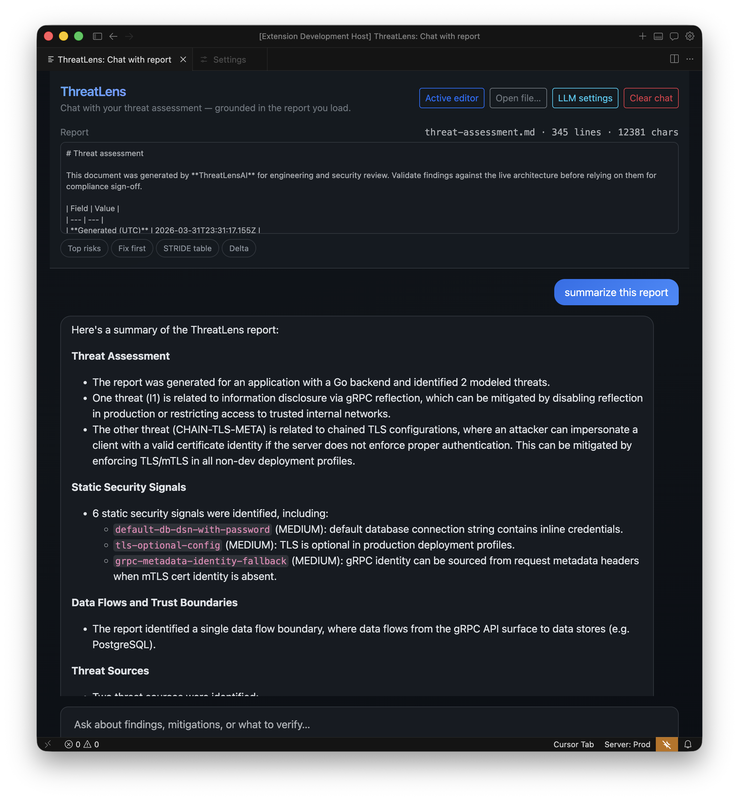

# ThreatLensAI

**Repo-grounded STRIDE threat modeling** for your IDE: analyze a codebase, merge deterministic static signals with LLM output, and ship **Markdown + HTML** assessments next to your code.

Use it from **Cursor/Claude (MCP)**, the **CLI**, or the **VS Code extension** (including **Chat with threat report**).

---

## Contents

- [ThreatLensAI](#threatlensai)
  - [Contents](#contents)
  - [What you get](#what-you-get)
  - [Screenshot](#screenshot)
  - [30-second quick start](#30-second-quick-start)
  - [Outputs and repeat runs](#outputs-and-repeat-runs)
  - [Choose your workflow](#choose-your-workflow)
  - [VS Code extension](#vs-code-extension)
  - [Markdown + HTML report (MCP)](#markdown--html-report-mcp)
  - [Security / SDLC handoff (the simple path)](#security--sdlc-handoff-the-simple-path)
  - [OWASP Threat Dragon](#owasp-threat-dragon)
  - [Development (this repo)](#development-this-repo)
  - [Test the MCP server in Cursor](#test-the-mcp-server-in-cursor)
  - [Why the MCP Output channel looks empty](#why-the-mcp-output-channel-looks-empty)
  - [License](#license)

---

## What you get

- **STRIDE/PASTA-style threats** with `related_paths`, `immediate_actions`, `mitigations`, and `verification` — not generic labels alone.
- **Go static analysis** in the engine: HTTP routes (Gin/Echo/Chi/Fiber/stdlib), gRPC hints, **`security_signals`** (pattern-based findings), **`flow_graph`**, **`mermaid_flow`**.
- **Signal-aware reports:** the LLM and post-processing **merge** scanner hits into threat cards; chained findings when **optional TLS** and **gRPC metadata identity fallback** co-exist.
- **Repeat runs:** `.threatlensai/baseline.json` stores the last finding set; the next report can show **NEW / UNCHANGED / RESOLVED** so fixes are visible.
- **Integrations:** MCP tools, CLI `threatlens`, VS Code commands, optional **Threat Dragon** export.

Full vision and roadmap: [Project.md](./Project.md).

---

## Screenshot

VS Code: **ThreatLens: Chat with threat report** — ask questions about a loaded `threat-assessment.md` (Ollama or Anthropic via settings).



---

## 30-second quick start

Run **from the root of your ThreatLensAI clone** (the directory that contains this `README.md` and the `engine/` folder):

```bash
npm install && npm run build
npm exec -w @threatlensai/cli threatlens report /path/to/your/app
```

**Requirements for `report`:** **`go`** on your **`PATH`** (the CLI runs `go run` on the engine), and an LLM: **`ANTHROPIC_API_KEY`** *or* **Ollama** with **`OLLAMA_MODEL`** set (e.g. `llama3.2`) while `ollama serve` is running.

If **`no parseable JSON object in model response`** appears while using **Ollama**, the threat JSON was likely **truncated** (output too long). Threat generation defaults to a larger output budget (**`16384`** tokens) and attempts to **repair** cut-off JSON; raise further with **`THREATLENS_THREAT_MAX_TOKENS`** (e.g. `32768`).

`npm run build` compiles TypeScript workspaces (`@threatlensai/ai`, MCP server, CLI) and the VS Code extension — it does **not** build a Go binary by itself; use **`THREATLENS_ENGINE_BIN`** if you want a prebuilt engine.

Equivalent:

```bash
npx --workspace=@threatlensai/cli threatlens report /path/to/your/app
```

If the CLI runs **outside** this monorepo, set **`THREATLENSAI_ROOT`** to the ThreatLensAI repo root, or **`THREATLENS_ENGINE_BIN`** to a built `threatlens-engine` binary.

---

## Outputs and repeat runs

Default artifacts **under the target app** (paths relative to that app):

| Artifact | Purpose |
| --- | --- |
| `security/threat-assessment.md` | Primary handoff: STRIDE register, findings, appendix |
| `security/threat-assessment.html` | Same content as a single-file dashboard (Mermaid in-page, severity badges) |
| `.threatlensai/baseline.json` | Previous finding set for **delta** labels on the next run |

Configure indexing once with **`threatlens init /path/to/app`** → **`.threatlensai.json`** (excludes, extensions, limits). A Cursor skill for SDLC handoff: [`.cursor/skills/threatlens-sdlc-handoff/`](./.cursor/skills/threatlens-sdlc-handoff/SKILL.md).

---

## Choose your workflow

| You want… | Use |
| --- | --- |
| **STRIDE threats inside Cursor / Claude** | Configure the **MCP server** (`threatlens-mcp`), then `analyze_codebase`, `generate_threats`, `write_threat_report`, … |
| **A committed assessment (Markdown + optional HTML)** | MCP **`write_threat_report`** with `root`, or CLI **`threatlens report .`** |
| **Just the static code graph (JSON), no LLM** | CLI **`threatlens analyze .`** or **`go run`** the engine under `engine/` |
| **Edit threats in OWASP Threat Dragon** | MCP **`export_threat_dragon`**, save JSON, open in Threat Dragon |
| **Mermaid architecture snippet** | MCP **`architecture_diagram`**, or system model **`mermaid_flow`** |

**Richer analysis (Go):** the system model includes **`http_routes`**, **`go_summary`** (`grpc_present`, `http_handlers_detected`, `primary_api_style`), **`grpc_endpoints`**, **`security_signals`**, **`flow_graph`**, **`mermaid_flow`**. gRPC-only services show **“gRPC API surface”** in the diagram instead of a misleading HTTP label.

---

## VS Code extension

The extension is **not** published on the VS Code Marketplace; you run it from this repo.

1. Open the **ThreatLensAI** folder in VS Code or Cursor.
2. **`npm install && npm run build`** once.
3. **Run → Start Debugging** (**F5**) → **ThreatLens: Run Extension**. A **new window** loads the extension.
4. Command Palette (**Cmd/Ctrl+Shift+P**) → type **`ThreatLens`**:

| Command | What it does |
| --- | --- |
| **ThreatLens: Analyze Workspace** | System model JSON |
| **ThreatLens: Show Architecture Flow (Mermaid)** | Webview from **`mermaid_flow`** |
| **ThreatLens: Chat with threat report** | Q&A over a loaded `.md` / `.html` report |

**LLM for chat:** set **`threatlens.ollamaModel`** (e.g. `llama3.2`) and run `ollama serve`, and/or **`threatlens.anthropicApiKey`** / **`ANTHROPIC_API_KEY`**. The panel’s **LLM settings** button opens Settings. Shell commands typed in chat do **not** change the extension host — use Settings or env vars before starting the editor.

---

## Markdown + HTML report (MCP)

**`write_threat_report`** runs **analyze + `generate_threats`**, then writes under the **application** root (default `security/threat-assessment.md`). Parameters: `root`, optional `output_path`, `title`, **`include_html`** (default **true**), `include_deep_dive`, `include_reference_appendix`. Response JSON includes `written_path`, `html_path`, and baseline/delta fields when applicable.

---

## Security / SDLC handoff (the simple path)

**You do not need every MCP tool.** For review, the main artifact is:

1. Add the MCP server (see [Test the MCP server](#test-the-mcp-server-in-cursor)) with **`ANTHROPIC_API_KEY`** or **`OLLAMA_MODEL`**.
2. In Agent chat: *“Call **`write_threat_report`** with **`root`** = absolute path to our app repo.”*
3. Commit **`security/threat-assessment.md`** and (by default) **`security/threat-assessment.html`**.

Similar in spirit to [STRIDE-GPT’s Docker flow](https://github.com/mrwadams/stride-gpt?tab=readme-ov-file#option-2-using-docker-container), but ThreatLensAI is **repo-grounded** and **IDE-native** so output stays next to your code.

Other tools (`generate_threats`, `export_threat_dragon`, `architecture_diagram`, `explain_threat`, …) are optional power-user paths.

---

## OWASP Threat Dragon

[OWASP Threat Dragon](https://github.com/OWASP/threat-dragon) is a visual STRIDE editor. ThreatLens **discovers** and **drafts** from the repo; Threat Dragon is for **review**, **DFD placement**, and **team workflow**.

- **MCP `export_threat_dragon`:** pass `root` (optional `title`). Returns **Threat Dragon v2–compatible JSON** (shape like [their demo models](https://github.com/OWASP/threat-dragon/tree/main/ThreatDragonModels)).
- **Workflow:** ThreatLens in Cursor → export JSON → refine in Threat Dragon → store in repo for audits.

If the stack is **gRPC + mTLS** and the LLM still says “HTTP”, treat that as noise until patterns improve — use Threat Dragon to draw **real** flows and re-home threats.

---

## Development (this repo)

Prerequisites: **Node.js 18+**, **Go 1.21+** (on `PATH` for `go run`, or **`THREATLENS_ENGINE_BIN`**).

```bash
npm install
npm run build   # TypeScript workspaces + VS Code extension compile
npm run test    # Go engine tests
```

- **Engine (Go):** `cd engine && go run ./cmd/threatlens-engine <path>` → JSON (packages/imports for `.go`, routes, **`security_signals`**, …).
- **CLI:** `npm exec -w @threatlensai/cli threatlens <command>` after build.
  - **`analyze`** — system model JSON only (not Markdown; `--output report.md` is rejected — use **`report`**).
  - **`threats`** — analyze + STRIDE JSON (needs LLM env).
  - **`init [path]`** — write **`.threatlensai.json`** if missing.
  - **`report`** — Markdown + HTML by default. Flags: `--output`, `--title`, `--no-deep-dive`, `--no-appendix`, **`--no-html`**.

---

## Test the MCP server in Cursor

1. **Build:** `npm install && npm run build`.
2. **Point Cursor at the server.** Edit MCP config (e.g. `~/.cursor/mcp.json`) with **absolute** paths to `node` and `packages/mcp-server/dist/index.js`:

```json
{
  "mcpServers": {
    "threatlensai": {
      "command": "/usr/local/bin/node",
      "args": [
        "/ABSOLUTE/PATH/TO/ThreatLensAI/packages/mcp-server/dist/index.js"
      ],
      "env": {
        "OLLAMA_MODEL": "llama3.2"
      }
    }
  }
}
```

Use **`OLLAMA_MODEL`** with `ollama serve` (e.g. `ollama pull llama3.2`). Optional: **`OLLAMA_HOST`**. For Claude, use **`ANTHROPIC_API_KEY`** and omit `OLLAMA_MODEL` (or **`THREATLENS_LLM=anthropic`** to force Claude if both are set).

3. **Restart Cursor** (or reload MCP).
4. **On your machine:** `go` on `PATH` or **`THREATLENS_ENGINE_BIN`**; for threats, **`ANTHROPIC_API_KEY`** or Ollama + **`OLLAMA_MODEL`**.
5. **Try in chat:** **`write_threat_report`** with `root` = your app’s absolute path. For analysis only: **`analyze_codebase`**; for STRIDE JSON without files: **`generate_threats`**.

**`explain_threat`** takes `threat_json` and optional `system_model_json` → long-form Markdown for one threat.

---

## Why the MCP Output channel looks empty

Cursor often **does not print each tool call** to **View → Output → MCP**. A healthy stdio MCP server is **silent on stdout** by design.

- Use **Agent mode** and ask explicitly: *“Call `analyze_codebase` with root `/abs/path`”*.
- **Debug:** set **`THREATLENS_MCP_DEBUG=1`** in the MCP server `env`. Or run manually:

```bash
THREATLENS_MCP_DEBUG=1 node /path/to/ThreatLensAI/packages/mcp-server/dist/index.js
```

(Ctrl+C to exit; confirms stderr logging.)

- **Ground truth:** `cd engine && go run ./cmd/threatlens-engine /path/to/project` and compare JSON.

---

## License

- [LICENSE](./LICENSE)
